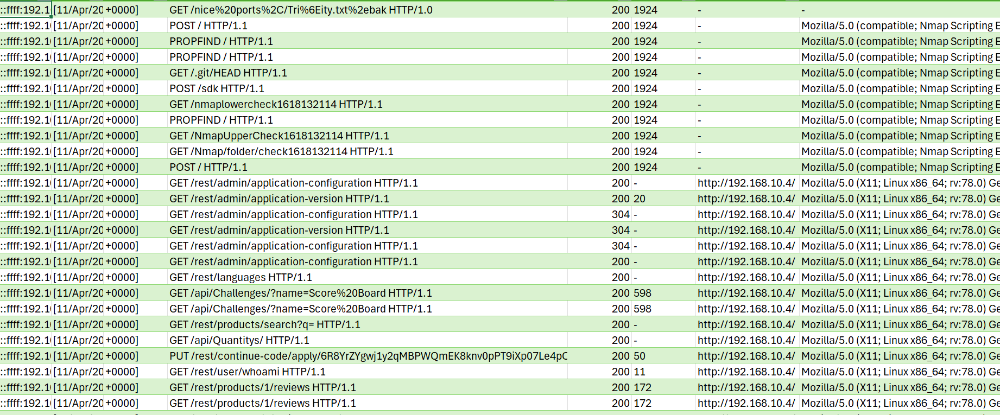

# TryHackMe
## [Juicy Details](https://tryhackme.com/room/juicydetails)
### Lab created by [GEEZET1](https://tryhackme.com/p/GEEZET1)
### Writeup created by [Cedar](https://tryhackme.com/p/Cedar)

# Introduction

> You were hired as a SOC Analyst for one of the biggest Juice Shops in the world and an attacker has made their way into your network. 
> 
> Your tasks are:
> 
> Figure out what techniques and tools the attacker used
> What endpoints were vulnerable
> What sensitive data was accessed and stolen from the environment
> An IT team has sent you a zip file containing logs from the server. Download the attached file, type in "I am ready!" and get to work! There's no time to lose!

In order to begin, we'll have to use the link at the top right of the challenge pane to download a .zip file containing the aforementioned logs.

Once we unzip the file, we're given three log files to explore: access, vsftp, and auth. Load these files using your favorite viewer (I'll be using Excel for this example) and we're ready to begin!

# Reconnaisance

## What tools did the attacker use? (Order by the occurrence in the log)

Once we view the "access" file, we quickly discover that the attacker has used Nmap to perform footprinting and fingerprinting. This gives us our first answer.

Next, the attacker attempts to crack passwords and gain authorization. Scrolling down, we can see that he has used a brute-force password cracking tool called Hydra, our second answer:

Once the attacker has credentials, they attempt to enumerate a database using SQLmap, a tool that uses scripts and dictionary lists to uncover resources that are otherwise not visible to the public and perform SQL injection attacks.

After discovering a useful file, the attacker uses cURL to download it. cURL is a tool that allows the creation of modified http requests from a command line in order to request, delete, or change data on a webserver.

The last tool the attacker uses is Feroxbuster, a directory enumeration tool that scans filesystems in order to index their contents and uncover locations and files.

After identifying all of these tools within the logs, we have our answers to the first question.

> nmap, Hydra, SQLmap, cURL, Feroxbuster

## What endpoint was vulnerable to a brute-force attack?

Going back to the section in our logs when we observed the attacker using Hydra to crack passwords, we can see the endpoint they targetted.

> /rest/user/login

## What endpoint was vulnerable to SQL injection?/What parameter was used for the SQL injection?

Refering to our logs where we saw evidence of the attacker using SQLmap, we can see that they used the following directory and parameter

> /rest/products/search

> q

## What endpoint did the attacker try to use to retrieve files? (Include the /)

Toward the end of the "access" file, we can see a succesful GET /ftp request, which gives us our last answer. Remember that the response for a succesful http request is 200 - this will be important later on.

# Stolen Data

## What section of the website did the attacker use to scrape user email addresses?

Following the initial nmap scan, we can see plenty of traffic coming through as the attacker crawls through individual items in a particular section of the website and sends whoami requests to discover changes in the user environment.

> product reviews

## Was their brute-force attack successful? If so, what is the timestamp of the successful login? (Yay/Nay, 11/Apr/2021:09:xx:xx +0000)

Remembering that the response code for a succesful http request is 200, we can go back through the logs displaying the attacker's use of Hydra and discover a succesful login request and timestamp:

> Yay, 11/Apr/2021:09:16:31 +0000

## What user information was the attacker able to retrieve from the endpoint vulnerable to SQL injection?

Refering to the section of the logs where we uncovered SQL injection attempts, we can identify a particular set of data that was succesfully retrieved by the attacker:

> Emails, Passwords

## What files did they try to download from the vulnerable endpoint? (endpoint from the previous task, question #5)

There are a couple giveaways for this: at the very end of the "access" file, and in the "vsftpd" file. The latter shows us that the attacker was succesful in downloading the files over FTP.

> coupons_2013.md.bak, www-data.bak

## What service and account name were used to retrieve files from the previous question? (service, username)

Referring once more to the "vsftpd" file, we can see a few unsuccesful attempts to log in under "anonymous", followed by a succesful attempt. This tells us which username the attacker was able to utilize to retrieve the files from the previous question.

> ftp, anonymous

## What service and username were used to gain shell access to the server? (service, username)

Finally, the logs in our "auth" file help us answer this question. We can see that after many failed attempts, the attacker is able to log in and create an SSH session.

> ssh, www-data

 

